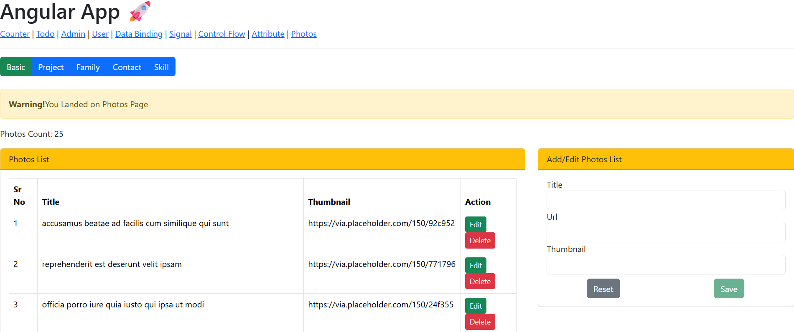
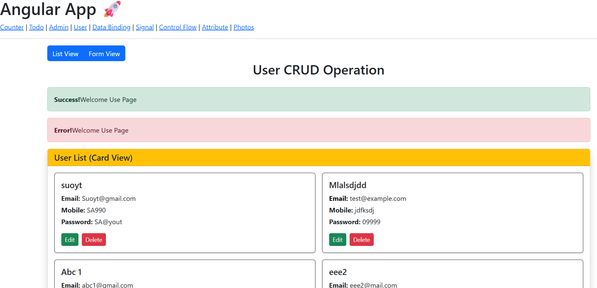

# Angular Practice Project 🚀

A simple Angular application built to practice core Angular concepts like routing, data binding, signals, attributes and component-based architecture.


---

## ✨ Features

- 📝 Todo List (Add / Delete tasks)
- 🔢 Counter App (Using Signals)
- 🔗 Routing between components
- 🔄 Data Binding (One-way & Two-way)
- 🎯 Control Flow (ngIf, ngFor)
- 🧩 Standalone Components Architecture

---

## 🛠️ Tech Stack

- Angular
- TypeScript
- HTML5
- CSS3

---

## 📂 Project Structure


src/
├── app/
│   ├── components/
│   │   ├── admin/
│   │   ├── user/
│   │   ├── todo/
│   │   ├── counter/
│   │   ├── signal/
│   │   ├── data-binding/
│   │   ├── control-flow/
│   │   ├── attribute/
│   │   └── photos/
│   ├── services/
│   ├── directives/
│   ├── models/
│   ├── pipes/
│   ├── reusableComponent/
│   ├── app.ts
│   ├── app.html
│   └── app.css


---

## 🚀 Getting Started

### 1️⃣ Install dependencies

```bash
npm install
2️⃣ Run the project
npm start

or

ng serve
3️⃣ Open in browser
http://localhost:4200

## 📸 Screenshots

### Todo List


### Customer List
	

Feature	
🎯 Purpose

This project was created to practice Angular fundamentals and strengthen frontend development skills.

👨‍💻 Author

Rakesh Prajapati
GitHub: https://github.com/RakeshPrajapati123


---
